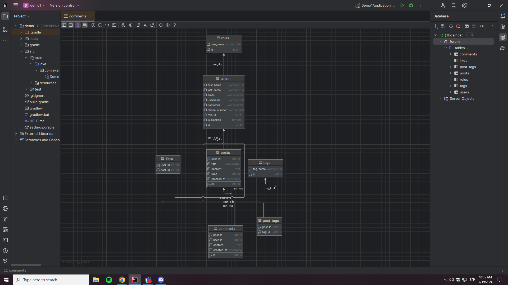

# Forum System

## Project Description
Design and implement a Forum System, where users can create posts, add comments, and upvote/downvote the things they like or dislike the most. The forum will be focused on {insert your forum topic here, e.g., automotive fanbase, java technical learning, crypto trading, fashion}.

## Functional Requirements

### Entities

#### Users
- Each user must have a first and last name, email, username, and password.
    - First name and last name must be between 4 and 32 symbols.
    - Email must be a valid email and unique in the system.

#### Admins
- Each admin must have a first and last name, email, and may have a phone number.
    - First name and last name must be between 4 and 32 symbols.
    - Email must be a valid email and unique in the system.

#### Posts
- Each post must have a user who created it, a title, content, comments, and how many likes it has received.
    - The title must be between 16 and 64 symbols.
    - The content must be between 32 symbols and 8192 symbols.
    - The post must have a user who created it.
    - Other users must be able to post replies.

## Public Part
- Accessible without authentication.
- On the home page, anonymous users must be presented with the core features of the platform, the number of users, and the number of posts created so far.
- Anonymous users must be able to register and log in.
- Anonymous users should be able to see a list of the top 10 most commented posts and a list of the 10 most recently created posts.

## Private Part
- Accessible only if the user is authenticated.
- Users must be able to log in and log out.
- Users must be able to browse posts created by other users with an option to sort and filter them.
- Users must be able to view a single post, including its title, content, comments, likes, etc. All details and available actions (comment/like/edit) should be presented on the same page.
- Users must be able to update their profile information, but not their username once registered. Users can upload a profile photo.
- Users must be able to create a new post with at least a title and content.
- Each user must be able to edit only their own posts or comments.
- Each user must be able to view all their or any other user's posts and comments (with options to filter and sort them).
- Each user must be able to remove one or more of their own posts, either from the details view or the post list.
- Each user must be able to comment/reply to any other forum post.

## Administrative Part
- Accessible to users with administrative privileges.
- Admins must be able to search for a user by their username, email, or first name.
- Admins must be able to block or unblock individual users. Blocked users cannot create posts or comments.
- Admins must be able to delete any post.
- Admins must be able to view a list of all posts with options to filter and sort them.

## Optional Features

### Post Tags
- Users can add tags to posts for easier navigation and searching.
- Tags can be added when editing a post.
- If a tag doesn't exist, it must be created in the database; if it exists, it should be reused.
- All tags should be in lowercase.

## REST API
- CRUD operations for users and posts.
- Search users by username, email, or first name.
- Filter and sort posts by tags.
- Admin operations for making other users admins, deleting posts, and blocking/unblocking users.
- Documentation with Swagger.

## Technical Requirements
- Follow OOP, KISS, SOLID, DRY principles.
- Use tiered project structure.
- Achieve at least 80% unit test code coverage in the service layer.
- Implement proper exception handling.
- Normalize the database to avoid data duplication and empty data.

## Database
- Store data in a relational database.
- Provide scripts to create and populate the database.

## Git
- Provide a complete GitHub repository with the project source code and database scripts.
- Ensure commits reflect the project development process and contributions from all team members.

## Setup and Run Instructions

### Prerequisites
1. Install [Java JDK 11+](https://www.oracle.com/java/technologies/javase-jdk11-downloads.html)
2. Install [Gradle](https://gradle.org/install/)
3. Install [MariaDB](https://mariadb.org/download/)
4. Install [Spring Boot](https://spring.io/projects/spring-boot)
5. Install [Spring Data JPA](https://spring.io/projects/spring-data-jpa)
6. Install [Spring Security](https://spring.io/projects/spring-security)
7. Install [Lombok](https://projectlombok.org/setup/gradle)

### Steps to Install
1. Clone the repository:
    ```bash
    git clone https://github.com/forum-RAI/forum-aplication.git
    cd forum-aplication
    ```

2. Set up the database:
    - Update `application.properties` or `application.yml` with Amazon RDS settings:

#### Example `application.properties`
```properties
spring.datasource.url=jdbc:mariadb://forumsystem.cpy86y2sqlgo.eu-north-1.rds.amazonaws.com:3306/ForumSystem
spring.datasource.username=admin
spring.datasource.password=123456789

# Other JPA/Hibernate settings if necessary
spring.jpa.hibernate.ddl-auto=update
spring.jpa.show-sql=true
spring.jpa.properties.hibernate.dialect=org.hibernate.dialect.MariaDBDialect
```


3. Install dependencies and compile the project:
    ```bash
    mvn clean install
    ```

4. Run the application:
    ```bash
    mvn spring-boot:run
    ```

## Link to Swagger Documentation
[Swagger Documentation](http://localhost:8080/swagger-ui/index.html)

## Link to the Hosted Project
[Hosted Project](Not applicable yet) (if applicable)

## Database Relations


## Contributors
- [Alexander Slavchev](https://github.com/AlexanderSlavchev)
- [Ivan Puhniev](https://github.com/ivanpuhnievv)
- [Radoslav Stoychev](https://github.com/RAStoychev18)